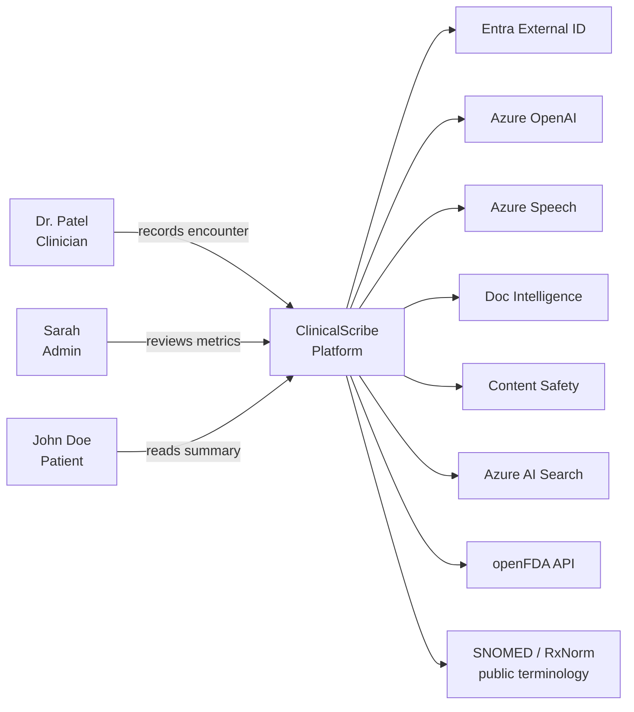
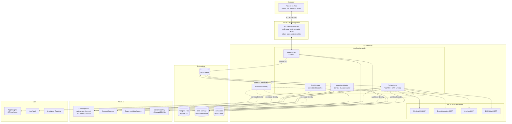
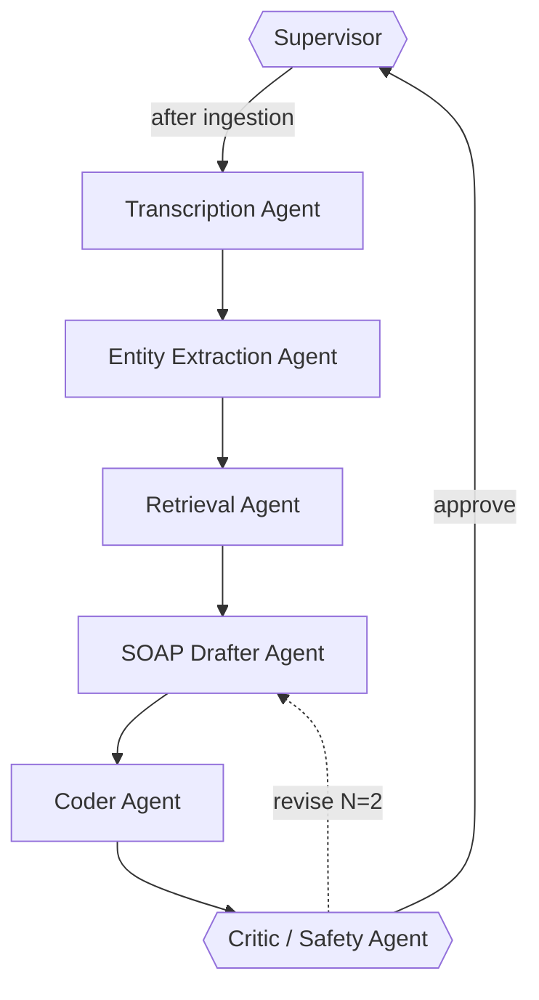
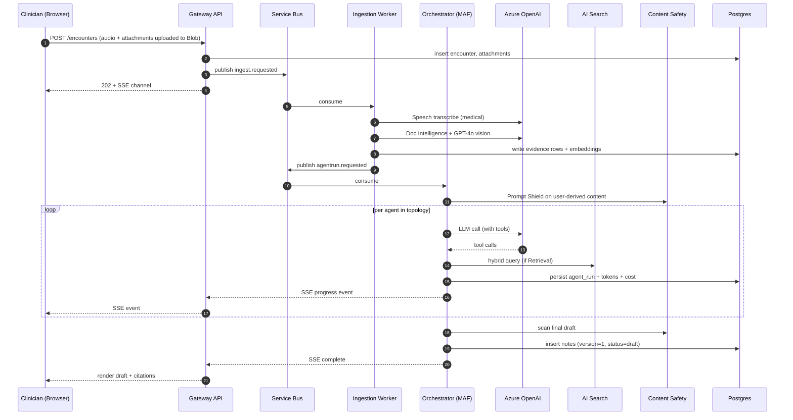

# ClinicalScribe — Architecture Document

**Status:** Draft v0.1 · awaiting approval
**Companion to:** `00-DECISIONS-REVIEW.md`, `01-PRD.md`

---

## 1. C4 — System context



## 2. C4 — Container view



## 3. Agent topology (MAF)



**Tools per agent** (every tool is either an MCP call or a typed Python function exposed via MAF):

| Agent | Tools |
|---|---|
| Transcription | `medical_kb.lookup_term`, `medical_kb.normalize_drug_name` |
| Entity Extraction | `medical_kb.lookup_term`, structured JSON output (no tools) |
| Retrieval | `ai_search.hybrid_query`, `pgvector.find_similar_encounters`, `ehr_mock.get_patient_history` |
| SOAP Drafter | `pgvector.cite_evidence`, structured output |
| Coder | `coding.search_icd10`, `coding.search_cpt`, `coding.justify_code` |
| Critic | `content_safety.scan_output`, `drug_interaction.check_combo`, `medical_kb.verify_claim`, fact-grounding rubric |

## 4. Data model (Postgres)

```
users(id, entra_oid, role, email, created_at)
patients(id, external_ref, name_synthetic, dob, sex)
encounters(id, patient_id, clinician_id, status, created_at, signed_at)
attachments(id, encounter_id, kind, blob_url, byte_size, sha256)
evidence(id, encounter_id, source_attachment_id, span, modality, content, embedding vector(3072))
agent_runs(id, encounter_id, agent, parent_run_id, status, prompt_version, started_at, finished_at,
           prompt_tokens, completion_tokens, cost_usd, error)
notes(id, encounter_id, version, soap_json, citations_json, created_at, created_by)
codes(id, encounter_id, system, code, rationale, accepted bool)
audits(id, encounter_id, actor_id, action, before_json, after_json, at)
patient_messages(id, patient_id, encounter_id, body, sent_at)
```

All FK constrained. Row-level security via Postgres policies keyed on `clinician_id` / `patient_id`.

## 5. Key sequence — "Generate SOAP from encounter"



## 6. Safety model (summary)

Three layers, defense in depth:

1. **Input layer** — Prompt Shields on anything user-derived, file scanning on uploads, schema validation on every external response.
2. **Reasoning layer** — Critic agent runs after every draft; tool-level hard stops (drug interactions); citation enforcement (every SOAP sentence must reference an Evidence id).
3. **Output layer** — Content Safety on outbound text, PII redaction for patient persona, mandatory clinician sign-off before any artifact is "final," append-only audit log.

Full doc in `docs/safety-model.md` once we start the repo.

## 7. Repository layout (final)

```
clinicalscribe/
├── apps/
│   ├── web/                    # Next.js SaaS UI (3 personas)
│   └── docs-site/              # Docusaurus
├── services/
│   ├── gateway/                # FastAPI public API
│   ├── orchestrator/           # MAF runtime
│   ├── ingestion-worker/       # Service Bus consumer
│   └── eval-runner/            # CronJob / GH Action
├── mcp-servers/
│   ├── medical-kb/
│   ├── drug-interaction/
│   ├── coding/
│   └── ehr-mock/
├── packages/
│   ├── schemas-py/             # Pydantic models, shared across services
│   ├── schemas-ts/             # Generated from OpenAPI for the web app
│   └── prompts/                # Versioned Jinja prompts, prompt registry
├── infra/
│   ├── terraform/
│   │   ├── backend.tf              # Azure Storage remote state (blob locking)
│   │   ├── providers.tf            # azurerm + azapi
│   │   ├── main.tf                 # composes modules
│   │   ├── variables.tf
│   │   ├── outputs.tf
│   │   ├── environments/
│   │   │   ├── dev.tfvars
│   │   │   ├── dev.backend.hcl
│   │   │   ├── prod.tfvars
│   │   │   └── prod.backend.hcl
│   │   └── modules/
│   │       ├── network/        # vnet, subnets, NSGs, private endpoints
│   │       ├── aks/            # cluster, node pools, workload identity
│   │       ├── data/           # cosmos, postgres flex, blob
│   │       ├── ai/             # aoai, speech, doc-intel, content-safety
│   │       ├── search/         # ai search
│   │       ├── messaging/      # service bus
│   │       ├── observability/  # app insights, log analytics
│   │       └── apim/           # ai gateway
│   │   bootstrap/                  # one-time: creates the state-backend storage account
│   └── helm/
│       ├── gateway/
│       ├── orchestrator/
│       ├── ingestion/
│       └── mcp-*/
├── evals/
│   ├── datasets/golden/        # 50 synthetic encounters
│   ├── runners/
│   └── reports/
├── scripts/
│   ├── seed-search-index.py    # CDC/NIH guidelines
│   ├── synth-encounters.py     # LLM-driven synthetic data
│   └── cost-report.py
├── .github/workflows/
│   ├── ci.yml
│   ├── eval-gate.yml
│   ├── cd-dev.yml
│   └── cd-prod.yml
├── docs/
│   ├── adr/
│   │   ├── 0001-architecture.md
│   │   ├── 0002-safety-model.md
│   │   ├── 0003-agent-topology.md
│   │   ├── 0004-polyglot-persistence-cosmos-and-postgres.md
│   │   ├── 0005-auth-clerk-with-entra-migration-path.md
│   │   └── 0006-iac-terraform.md
│   ├── architecture.md
│   ├── safety-model.md
│   ├── demo.md
│   └── images/
├── LICENSE                     # MIT, with explicit "not for clinical use" rider
├── README.md
└── SECURITY.md
```

## 8. Environments

| Env | Where | Purpose |
|---|---|---|
| `local` | Docker Compose | All services + Postgres + Azurite + a fake AOAI proxy |
| `dev` | AKS in `cs-dev-rg` | Continuous deploy from `main` |
| `prod` | AKS in `cs-prod-rg` | Deploy on tagged release |

## 9. CI/CD pipeline

```
PR opened ─► lint ─► type-check ─► unit ─► integration
          ─► terraform fmt + validate + tflint + tfsec + checkov
          ─► eval-gate (smoke 5 cases) ─► allow merge
main merged ─► full eval (50 cases)
            ─► terraform plan against dev (artifact uploaded for review)
            ─► terraform apply dev (auto, with state lock)
            ─► build + push images ─► helm upgrade dev ─► smoke e2e ─► notify
tag v* ─► gates as above
       ─► terraform plan against prod (MANUAL approval gate via GH Environments)
       ─► terraform apply prod
       ─► helm upgrade prod ─► canary 10% 30min ─► full rollout
```

**Auth from GitHub Actions to Azure:** Workload Identity Federation (OIDC) — no service principal secrets in GitHub. Federated credential per environment.

## 10. Open questions (need your call before Phase 0)

| # | Question | Default if you don't answer |
|---|---|---|
| Q1 | Repo location — create the new repo at `c:\Working\clinicalscribe\` or alongside existing at `c:\Working\RAGwithAzureOpenAI\clinicalscribe\`? | New folder `c:\Working\clinicalscribe\` |
| Q2 | GitHub org/account — push to your personal `github.com/<your-user>/clinicalscribe`? | Yes, personal account |
| Q3 | Azure subscription — do you already have one allocated for this, or do we set up a fresh resource group? | New RG `cs-dev-rg` in `eastus2` |
| Q4 | Should we host the Docusaurus site on **GitHub Pages** or **Azure Static Web Apps**? | GitHub Pages (free, simpler) |
| Q5 | Demo data: any specific medical scenario you want as the headline demo (e.g., "60yo with T2DM and hypertension annual visit")? | Yes, that exact scenario as canonical demo |
| Q6 | License — MIT with non-clinical-use disclaimer OK, or do you prefer Apache 2.0 / AGPL? | MIT + disclaimer |
